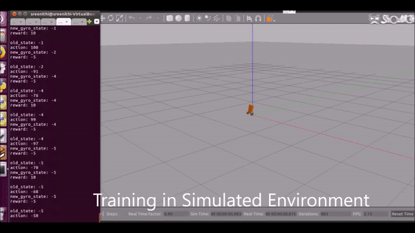

# Reinforcement-Learning-Self-Balancing-Robot
The Self-balancing [Teeterbot Robot Model](https://github.com/robustify/teeterbot) was used and extended with a Reinforcement Learning () algorithm with ROS to make the robot learn to balance itself in a simulated environment in Gazebo

## Project Video

The above video shows the RL learning in the simulation environment. The project also involved the use of an altered structure of LEGO Mindstorms EV3 Gyroboy robot on which the RL algorithm was first trained, and due to some hardware constraints, the training was then shifted to the simulation environment. The entire project video can be found [here](https://www.youtube.com/watch?v=_rXDSA3yE5I)

## Nodes
The RL algorithm was run on the *RLNode* defined in the *ev3-rl-simulation.py* program in the teeterbot_gazebo package

## Publishers, Subscribers and Services
* Publishing and Subscribing Topics used by the RL program
  * /gazebo/model_states - Topic that the RLNode subscribes to, obtain the orientation and hence the pitch value of the robot. To get the angle of inclination of the robot to the ground
  * /teeterbot/left_motor_voltage and /teeterbot/right_motor_voltage - Topic that the RLNode publishes to, in order to command the robot to move
These were the only topics used by the RLNode, while there are many other topics and services that the Teeterbot itself uses.
  
## ROS and Ubuntu version used
ROS Kinetic in Ubuntu 16.04
